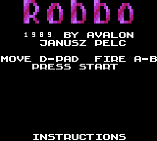

# Robbo — Game Boy Color

A Game Boy Color build of **Robbo**, the 1989 tile-based puzzle game (Janusz Pelc / LK Avalon),
built with [GBDK-2020](https://github.com/gbdk-2020/gbdk-2020).

It runs the game logic of **[GNU Robbo](https://sourceforge.net/projects/gnurobbo/)** — the
faithful open-source reimplementation — ported to the Game Boy Color, with the original Atari
8-bit graphics, sound and colours.



## What it is

Robbo is a tile-based puzzle game. In each room you collect every **screw** to activate the exit
**capsule**, then reach it — while pushing boxes, shooting bullets, opening **doors** with keys,
using **teleports**, dodging **bombs**, **lasers** and **magnets**, and avoiding roaming
**monsters** (bears, birds, butterflies). Touch a monster, a bomb blast or a wall you're forced
into and the room explodes; you respawn and try again.

- **Levels:** all 56 rooms converted from the original Atari level data.
- **Logic:** GNU Robbo's `board.c` engine — objects, monsters, explosions, teleports, magnets,
  guns/blasters, doors and the screw→capsule exit all behave exactly as upstream.
- **Look:** the original Atari **font** (16×16 metatiles from ANTIC mode-4 chars) and the
  authentic per-level **colour palettes**, plus the Atari **sound effects** and title
  **instruction text**.

## Controls

| Button | Action |
|--------|--------|
| D-pad | Move Robbo (walk, collect items, push boxes) |
| A + D-pad | Fire a bullet in that direction (uses ammo) |
| Start | Begin game (title screen) · in-game opens the pause menu |

The pause menu offers **Resume**, **Restart**, **Warp** (jump to any level) and **Quit**.
HUD (bottom two rows): screws left · keys · ammo · lives · level · score.

## Build

Requires the bundled GBDK-2020 (in `third_party/gbdk/`) and `python3`. Asset conversion reads the
original Atari game data (font, sound, text, levels and palettes); override its location with
`ORIG=` if it lives elsewhere:

```sh
make            # regenerates assets + levels, builds build/robbo.gbc
make clean
```

Output: `build/robbo.gbc` — a CGB ROM (MBC5) that runs in any Game Boy Color emulator or on
hardware via a flashcart.

### Verify headlessly

`tools/shot.py` boots the ROM in [PyBoy](https://github.com/Baekalfen/PyBoy) and saves a PNG:

```sh
python3 tools/shot.py build/robbo.gbc out.png 200 "120:start:5,200:up:40"
```

The camera regression uses a built [Coffee GB](https://github.com/trekawek/coffee-gb)
core and its dependency JARs on `CAMERA_TEST_CP`. Generate matching linker symbols, then run:

```sh
make clean
make LCCFLAGS_EXTRA='-Wl-m -Wl-j'
java --class-path "$CAMERA_TEST_CP" tools/CameraTest.java build/robbo.gbc
```

It checks scrolling in all four directions, reversals, level bounds, vertical map wrapping,
and that scroll registers only change outside the visible frame.

Cannon conversion regressions run with `python3 tools/test_convert_atari_levels.py`.
With Coffee GB and matching linker symbols, `java --class-path "$CAMERA_TEST_CP"
tools/CannonTest.java build/robbo.gbc` checks level 22's three left-hand cannons.
It verifies right-facing blasters, then removes their blocking boxes to isolate
firing behavior and checks that all three clear debris while preserving screws.
The same test verifies the projectile-head and animated blast-trail tiles.

All 15 sound effects can be recorded and checked against the Atari tables with
`make sound-test SOUND_TEST_CP="$SOUND_TEST_CP"` (a built Coffee GB core and its
dependency JARs). See [the sound audit](docs/sound-audit.md) for the comparison,
remaining hardware approximations, and reference-audio generation.

The [PAL colour audit](docs/pal-colors.md) compares all 56 rooms with the original
running in Atari800, including normal/inverse glyphs, cave fill and the HUD.
It includes commands for native reference captures and a full-board GBC regression.

[Performance measurements](docs/performance.md) cover ten representative rooms,
including level 4, with a symbol-driven Coffee GB benchmark and per-tick board
comparisons. A fractional clock keeps movement at the [Atari PAL pace](docs/pal-timing.md)
instead of letting faster processing accelerate gameplay.

## Layout

```
src/board.c          GNU Robbo's engine (update_game split into upd_g1..g5 so SDCC compiles it)
src/board_upd.c      the per-object update cases (banked)
src/board_robbo.c    Robbo's own move/shoot logic (banked)
src/glue.c           main loop: input, tick pacing, render scheduling, pause menu
src/render.c         board -> tiles+palettes, the scrolling viewport, Robbo's facets
src/loader.c         level load: board setup + per-level palette + tile/HUD init
src/hud.c            window-layer HUD (screws/keys/ammo/lives/level/score)
src/menu.c           title screen + pause/warp menu (banked)
src/atari_pal.c      the 56 authentic per-level Atari colour palettes (banked)
src/globals.c        shared game state
src/levels_*.c       generated level data (HOME index + banked grid modules)
src/object_tables.c  LOOK (byte->glyph) and animation tables
src/sound.c          GB-channel sound effects
src/gen/             generated assets (gfx_tiles.*, sounds.h, instr.h)
tools/               asset/level converters + the screenshot helper
```

### How rendering works

Each room is a grid of object bytes. An object is a **16×16 metatile** of four 8×8 chars:
`LOOK[b]` gives a screen code `sc`, and the four chars are `sc`, `sc|1`, `sc|0x20`, `sc|0x21`,
drawn from the Atari playfield charset (pixel-doubled to the chunky 8px look). A cell uses the
level's normal or inverse palette purely by the glyph's high (inverse) bit.

The playfield (16 cells wide × 31 tall = 256×496px) is larger than the screen, so a **scrolling
viewport follows Robbo** with fractional easing on every VBlank, independently of game-logic
speed. Both scroll registers update before the visible frame to avoid tearing. The BG map
is only 32×32 tiles, so the tall field can't fit at once: `render.c` keeps a **16-row rolling
window** in the map (`slot_owner[]`) and streams new rows ahead of the camera. Vertical
targets stay within the uploaded rows, including when following a teleport.
