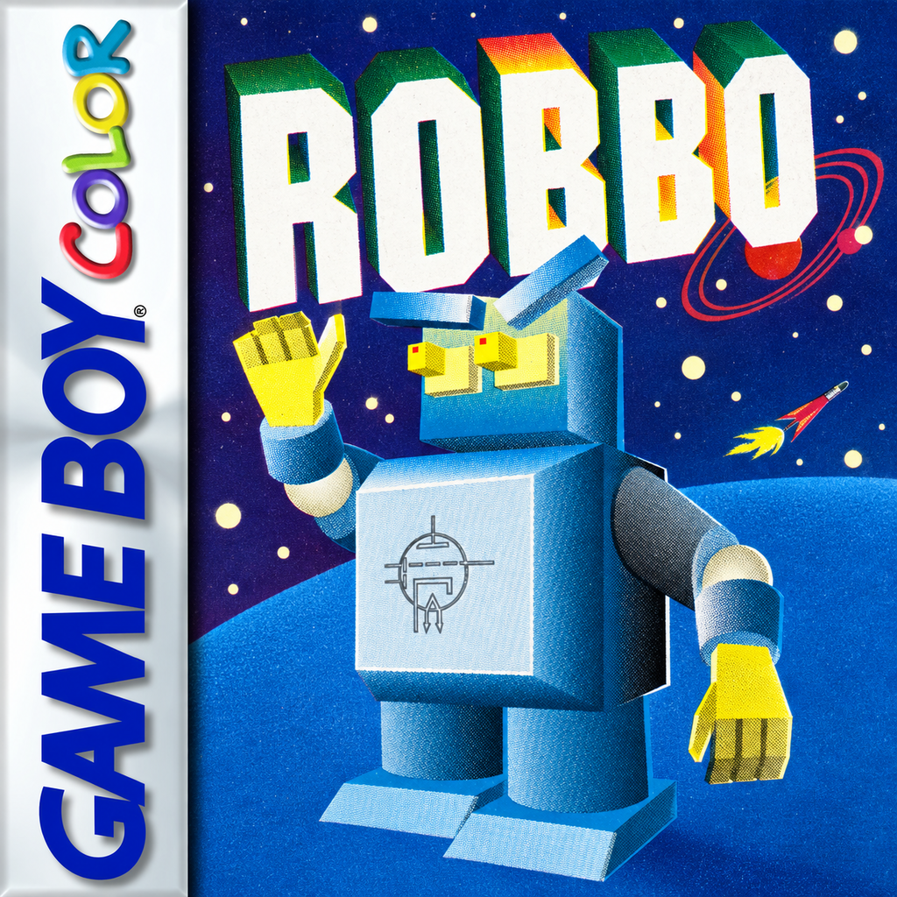

# ROBBO — Game Boy Color

ROBBO is a puzzle game created by Janusz Pelc and published by LK Avalon in 1989
for Atari 8-bit computers. One of the first commercial Polish games, it became a
[landmark of Polish gaming history](https://culture.pl/pl/tworca/lk-avalon).

This project is a port of ROBBO for the Nintendo Game Boy Color.

